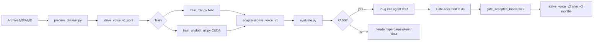

# idrivecars.pl Author Voice LoRA

Train a **recognizable author voice** from the 10-year test archive — a quality tool for consistent drafting, not camouflage or generic AI filler.

## Layout

```
lora/
├── config.yaml              # Model paths, LoRA hyperparameters, adapter versioning
├── banned_phrases.txt       # AI filler phrases (0 hits required before deploy)
├── prepare_dataset.py       # Archive MDX/MD → JSONL instruction→text pairs
├── train_mlx.py             # QLoRA on Apple Silicon (owner's Mac, MLX)
├── train_unsloth_alt.py     # Alternative on CUDA (e.g. RTX 5080, Unsloth)
├── evaluate.py              # Blind test export + lint + hallucination check
├── voice_utils.py           # Shared scrubbing / banned-phrase helpers
├── datasets/
│   ├── idrive_voice_v1.jsonl
│   └── gate_accepted_inbox.jsonl   # append gate-approved drafts for v2
├── adapters/
│   └── idrive_voice_v1/
└── eval/
    ├── blind_test_*.json
    └── eval_report_*.json
```

## Workflow



### 1. Prepare dataset

```bash
cd lora
python3 -m venv .venv && source .venv/bin/activate
pip install -r requirements.txt

# Auto-detects ../content/testy or ../site/src/content/tests
python prepare_dataset.py

# Or explicit paths:
python prepare_dataset.py \
  --input ../content/testy \
  --output datasets/idrive_voice_v1.jsonl \
  --target-min 500 --target-max 2000
```

**Training pair types**

| Type | Instruction | Output |
|------|-------------|--------|
| `facts_to_style` | Press/spec bullets | Author-style paragraph |
| `outline_to_paragraph` | Section outline + car context | Test paragraph |

Dates, prices, and years are replaced with `{{DATE}}`, `{{PRICE}}`, `{{YEAR}}` so the model learns voice, not stale numbers.

### 2. Train (pick one backend)

**Mac (48 GB, MLX — primary path for owner)**

```bash
pip install mlx mlx-lm
python train_mlx.py --config config.yaml
```

**CUDA worker (RTX 5080, Unsloth — if model fits)**

```bash
python train_unsloth_alt.py --config config.yaml
```

Hyperparameters (see `config.yaml`): LoRA rank 16–32, 2–3 epochs, 10% holdout, adapter `idrive_voice_v1`.

Dry-run split preparation without MLX:

```bash
python train_mlx.py --dry-run
```

### 3. Evaluate before deploy

```bash
# After running inference, save generations to eval/generations.json
python evaluate.py --generations eval/generations.json
```

Checks:

1. **Blind test** — exports 10 pairs (`reference_author_text` vs `model_generation`) for owner scoring 1–5.
2. **Banned phrases** — must be **0 hits** (loads `banned_phrases.txt` and `agent/draft/banned_phrases.py` if present).
3. **Hallucination** — on 20 samples, numeric/spec tokens in generation must appear in the instruction.

Exit code `0` = pass, `2` = fail.

### 4. Plug into agent draft

Point the orchestrator (Qwen + LoRA adapter) at:

- Adapter: `lora/adapters/idrive_voice_v1`
- Prompt template: `config.yaml` → `prompt_template`
- Banned phrase lint: reuse `banned_phrases.txt` in the draft pipeline

## Feedback loop (v2)

1. Owner gates drafts in the agent pipeline (accept / reject).
2. Append accepted instruction→text pairs to `datasets/gate_accepted_inbox.jsonl`.
3. Merge into `prepare_dataset.py` input (or re-run with combined source).
4. After ~3 months of gate-accepted texts, bump `adapter.name` to `idrive_voice_v2` in `config.yaml` and retrain.

## Adapter versioning

| Version | Dataset | When |
|---------|---------|------|
| `idrive_voice_v1` | Archive testy | Initial training |
| `idrive_voice_v2` | Archive + gate-accepted | ~3 months after v1 gate acceptance |

## Notes

- **English code/comments** throughout; training text is Polish (author archive).
- Target **500–2000** examples; augmentation fills gaps if the archive alone is smaller.
- This scaffolding is runnable; MLX/Unsloth are optional installs on the target machine.
- Training scripts print clear install instructions when dependencies are missing.
